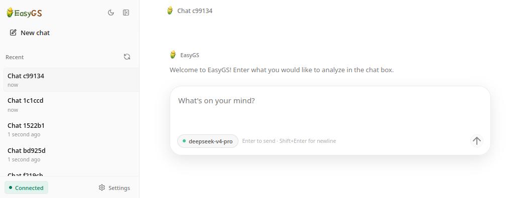

<div align="center">
  
  <h1>EasyGS: An Easy-to-Use AI Agent for Natural Language-Driven Crop Genomic Selection Analysis</h1>
  
  
  
  <p>
    <a href="README.md">
      
    </a>
    <a href="README_zh.md">
      
    </a>
  </p>
</div>

EasyGS is an AI agent for crop genomic selection analysis. Users can describe their analysis needs in natural language, and EasyGS helps check input files, complete parameters, call human-verified GS analysis workflows, and organize output results, helping you complete GS analysis tasks.

## :raised_hands: Why EasyGS?

- **Professional GS analysis capabilities**: 39 human-reviewed and validated GS analysis tools covering common steps such as data QC, population structure, genetic parameter estimation, genomic prediction, environmental interaction, GWAS, and functional annotation.
- **Natural-language driven**: submit analysis tasks involving VCF files, phenotype data, environmental factors, gene annotation, and more through conversation without manually writing code.
- **Long tasks run in the background**: tasks execute in the background, so you do not need to worry about interruptions.
- **Fully traceable**: check analysis progress at any time, keep intermediate results for every step, and review the workflow whenever needed.
- **Flexible usage**: use EasyGS through the Web UI, command line, Telegram, Feishu/Lark, and other messaging channels, so you can choose the workflow that suits you.

## :earth_asia: Interface Preview

<table>
  <tr>
    <td align="center" valign="top" width="55%">
      <h3>Web UI</h3>
      <p>Chat with EasyGS in your browser, simply and efficiently</p>
      </br>
      </br>
      
    </td>
    <td align="center" valign="top" width="45%">
      <h3>Multiple Chat Integrations</h3>
      <p>Use EasyGS through Telegram, Feishu/Lark, and other messaging channels, including on mobile devices</p>
      
    </td>
  </tr>
</table>

## :tada: Feature Preview

<table>
  <tr>
    <td align="center" valign="top" width="60%">
      <h3>Real-Time Workflow Query</h3>
      <p>Check the status, progress, and results of background analysis tasks at any time</p>
      
    </td>
    <td align="center" valign="top" width="40%">
      <h3>Fully Traceable Process</h3>
      <p>Keep analysis steps and intermediate results for easy workflow review</p>
      
    </td>
  </tr>
</table>

<div align="center">
  <h3>Diverse GS Analysis Tools</h3>
  <p>Covering common workflows such as data QC, genomic prediction, GWAS, environmental interaction, correlation analysis, functional annotation, and more...</p>
  <table>
    <tr>
      <td align="center" valign="top" width="50%">
        
      </td>
      <td align="center" valign="top" width="50%">
        
      </td>
    </tr>
  </table>
</div>

<p align="center"><strong>More tools are waiting for you to explore...</strong></p>

## :raising_hand: Installation

> [!WARNING]
> EasyGS is an AI Agent that can execute analysis tasks and may create, modify, or delete files. Use it in a test or dedicated working directory, and back up important data in advance. Direct production use is not recommended.

The easiest way to use EasyGS is to install it locally.

### 1. Requirements

- Python 3.11 or newer
- conda or mamba
- An available LLM API key

### 2. Install EasyGS

Install the latest released wheel directly from GitHub:

```bash
pip install https://github.com/lukegood/EasyGS/releases/download/v0.1.5/easygs-0.1.5-py3-none-any.whl
```

You can also open the release page and download the wheel manually:

- Latest release: <https://github.com/lukegood/EasyGS/releases/latest>
- Current wheel: <https://github.com/lukegood/EasyGS/releases/download/v0.1.5/easygs-0.1.5-py3-none-any.whl>

After downloading the file, install it with:

```bash
pip install /path/to/easygs-0.1.5-py3-none-any.whl
```

Confirm that the installation succeeded:

```bash
easygs --version
```

### 3. Install Analysis Dependencies

EasyGS analysis tools depend on several conda environments. Download the source code from the release page, or clone the repository, then use the `env_all/` directory to create the environments:

```bash
git clone https://github.com/lukegood/EasyGS.git
cd EasyGS
```

```bash
conda env create -f env_all/EasyGS_1.yml
conda env create -f env_all/EasyGS_2.yml
conda env create -f env_all/EasyGS_3.yml
conda env create -f env_all/EasyGS_4.yml
```

If an environment already exists, you can skip the corresponding command.

### 4. Initialize Configuration

```bash
easygs onboard
```

This command creates the default configuration file and workspace:

```text
~/.easygs/config.json
~/.easygs/workspace/
~/.easygs/resources/
```

### 5. Configure the Model and Workspace

Open the configuration file:

```bash
nano ~/.easygs/config.json
```

You can also use your preferred editor, such as VS Code, vim, or a text editor available on your server.

#### 5.1 Configure the LLM Provider

First decide which model provider you want to use, then configure only that provider. Common provider names include:

| If you use | Configure this item |
| --- | --- |
| DeepSeek | `providers.deepseek` |
| GLM / Zhipu AI | `providers.zhipu` |
| Kimi / Moonshot | `providers.moonshot` |
| MiniMax | `providers.minimax` |
| Qwen / Alibaba Cloud DashScope | `providers.dashscope` |
| Custom compatible endpoint | `providers.custom` |

Your configuration file may already contain multiple provider sections. Providers you do not use can be left empty.

#### 5.2 Fill Provider Credentials

Under the provider you selected, fill in `apiKey` and `apiBase`. `apiKey` is the provider key, and `apiBase` is the API address provided by the provider or gateway.

For example, when using DeepSeek:

```json
{
  "providers": {
    "deepseek": {
      "apiKey": "your-api-key",
      "apiBase": "your-api-base"
    }
  }
}
```

If you use a custom compatible endpoint, fill in `apiKey` and `apiBase` under `custom` in the same way:

```json
{
  "providers": {
    "custom": {
      "apiKey": "your-api-key",
      "apiBase": "https://your-api-base/v1"
    }
  }
}
```

#### 5.3 Configure the Default Model

After configuring the provider, set `agents.defaults.model`. The model name should match the provider:

| Provider | Model name example |
| --- | --- |
| `providers.deepseek` | `deepseek-v4-pro` |
| `providers.zhipu` | `glm-5.1` |
| `providers.moonshot` | `kimi-k2.6` |
| `providers.minimax` | `MiniMax-M2.7` |
| `providers.dashscope` | `qwen-3.6-plus` |
| `providers.custom` | A model name supported by your custom service |

For example, when using DeepSeek V4 Pro, set the model, generation limit, and reasoning effort together:

```json
{
  "agents": {
    "defaults": {
      "model": "deepseek-v4-pro",
      "maxTokens": 384000,
      "reasoningEffort": "max"
    }
  }
}
```

`maxTokens` controls the maximum generation length for a single response, and `reasoningEffort` sets the reasoning intensity for DeepSeek V4 Pro. DeepSeek V4 models support up to 1M context and up to 384000 output tokens on the model side. EasyGS does not expose a `contextWindow` control; it passes the current conversation, tool results, and analysis context to the selected model.

#### 5.4 Save and Check the Configuration

After saving `~/.easygs/config.json`, run:

```bash
easygs status
```

If the status output says the provider is not configured, check:

- Whether the corresponding `providers.<name>.apiKey` has been filled in.
- Whether the corresponding `providers.<name>.apiBase` has been filled with the complete API address provided by the provider or gateway.
- Whether `agents.defaults.model` is set to the model name for the corresponding provider.

### 6. Enable the Web UI and Start Using EasyGS

The Web UI is recommended as the default interaction mode. First enable websocket in `~/.easygs/config.json`:

```json
{
  "channels": {
    "websocket": {
      "enabled": true,
      "port": 25685
    }
  }
}
```

Start the service:

```bash
easygs gateway
```

If EasyGS runs on your local machine, open this directly in your browser:

```text
http://127.0.0.1:25685
```

If EasyGS runs on a remote server, first create an SSH port forward from your own computer:

```bash
ssh -L 25685:127.0.0.1:25685 user@server_ip
```

Replace `user@server_ip` with your server login username and address. Keep this SSH connection open, then open this URL in your own computer's browser:

```text
http://127.0.0.1:25685
```

If local port `25685` is already in use, choose another local port, for example:

```bash
ssh -L 18080:127.0.0.1:25685 user@server_ip
```

Then open:

```text
http://127.0.0.1:18080
```

After entering the Web UI, you can directly submit analysis tasks in natural language. For example:

```text
Please check the basic statistics for /data/example.vcf.gz
```

You can also use the command line as a supplement. For a one-shot request:

```bash
easygs agent -m "Please check the basic statistics for /data/example.vcf.gz"
```

For an interactive command-line conversation:

```bash
easygs agent
```

## :whale: Using Docker

If you want to use a container to standardize the runtime environment, you can use Docker.

```bash
cd /path/to/easygs
cp .env.example .env
mkdir -p ./easygs-home ./data
```

Edit `.env` and fill in the image, model, and provider credentials. When using DeepSeek V4 Pro, you can use:

```dotenv
EASYGS_MODEL=deepseek-v4-pro
EASYGS_MAX_TOKENS=384000
EASYGS_REASONING_EFFORT=max
```

Then start:

```bash
docker compose pull
docker compose up -d
```

Make sure `EASYGS_IMAGE`, `EASYGS_MODEL`, and the credentials for your selected provider are configured. `EASYGS_MAX_TOKENS` and `EASYGS_REASONING_EFFORT` map to the default EasyGS agent configuration. Inside the container, use `/data/...` paths to refer to mounted data files. For more details, see [container/README.md](container/README.md).

## :clap: 39 GS Analysis Tools

| Category | Function | Description |
| --- | --- | --- |
| Data QC | VCF statistics (`vcf_stats`) | Generate basic VCF statistics. |
| Data QC | Allele frequency analysis (`allele_frequency_analysis`) | Use vcftools to analyze allele frequency and summarize the proportion of polymorphic sites. |
| Data QC | MAF distribution analysis (`maf_distribution_analysis`) | Use PLINK to analyze minor allele frequency distribution. |
| Data QC | Missingness analysis (`missingness_analysis`) | Use PLINK to analyze site or sample missingness. |
| Data QC | Variant filtering (`variant_filter_analysis`) | Use PLINK to filter by sample missingness, variant missingness, HWE, and MAF. |
| Data QC | VCF format conversion (`vcf_format_conversion_analysis`) | Convert between VCF and PLINK BED/BIM/FAM or PED/MAP formats. |
| Data QC | Genotype encoding (`genotype_encoding_analysis`) | Use PLINK to encode additive 0/1/2 genotypes. |
| Data QC | VCF variant extraction (`vcf_variant_extract_analysis`) | Extract target subsets from VCF by variant or sample list. |
| Data QC | LD pruning analysis (`ld_prune_analysis`) | Use PLINK for LD pruning. |
| Data QC | Regional R2 analysis (`region_r2_analysis`) | Use PLINK for regional linkage disequilibrium R2 analysis. |
| Data QC | Genotype imputation (`genotype_imputation_analysis`) | Use Beagle for genotype imputation. |
| Population genetic structure | Nucleotide diversity analysis (`nucleotide_diversity_analysis`) | Use vcftools to calculate site-level or window-based nucleotide diversity pi. |
| Population genetic structure | PCA analysis (`pca_analysis`) | Use PLINK for principal component analysis. |
| Population genetic structure | ADMIXTURE analysis (`admixture_analysis`) | Use ADMIXTURE for population structure analysis and automatically determine the best K value. |
| Population genetic structure | Genomic relationship matrix GRM (`grm_analysis`) | Use GCTA to construct a genomic relationship matrix. |
| Population genetic structure | LD decay analysis (`ld_decay_analysis`) | Use PopLDdecay for linkage disequilibrium decay analysis. |
| Genetic parameter estimation and genomic prediction | Heritability estimation (`heritability`) | Use GCTA to calculate single-trait heritability. |
| Genetic parameter estimation and genomic prediction | Variance decomposition (`variance_decomposition_analysis`) | Use linear models to decompose phenotypic variance into genotype, environment, and residual components. |
| Genetic parameter estimation and genomic prediction | Phenotype BLUP analysis (`phenotype_blup_analysis`) | Calculate BLUP values from multi-environment phenotype data. |
| Genetic parameter estimation and genomic prediction | Combining ability analysis (`combining_ability_analysis`) | Estimate parental GCA and hybrid SCA. |
| Genetic parameter estimation and genomic prediction | GEBV estimation (`gebv_analysis`) | Use GCTA to estimate genomic estimated breeding values. |
| Genetic parameter estimation and genomic prediction | rrBLUP genomic prediction (`rrblup_prediction_analysis`) | Use rrBLUP for genomic prediction. |
| Genetic parameter estimation and genomic prediction | VCF genomic prediction matrix (`vcf_genomic_prediction_csv_analysis`) | Generate a 0/1/2 genotype CSV matrix from VCF. |
| Genetic parameter estimation and genomic prediction | Cross-validation grouping (`cvf_split_analysis`) | Generate cross-validation grouping CSV files from material lists. |
| Environment and phenotype parsing | Environmental-factor correlation analysis (`env_factor_correlation_analysis`) | Calculate Pearson correlations among different environmental factors in the same region and draw a heatmap. |
| Environment and phenotype parsing | Cross-region phenotypic correlation analysis (`cross_region_phenotypic_correlation_analysis`) | Calculate Pearson correlations for the same phenotype across different regions and draw a heatmap. |
| Environment and phenotype parsing | Environment index analysis (`environment_index_analysis`) | Run environment index analysis based on the CERIS framework. |
| Environment and phenotype parsing | Reaction norm analysis (`reaction_norm_analysis`) | Convert multi-environment phenotype data to long format and calculate reaction norm intercepts and slopes. |
| Environment and phenotype parsing | Genotype-by-environment GxE analysis (`GxE_analysis`) | Run SNP x environmental factor ANOVA from VCF, environmental factors, and phenotype data. |
| Gene mining and functional interpretation | GWAS analysis | Use three rMVP algorithms for genome-wide association analysis. |
| Gene mining and functional interpretation | QEI detection analysis (`QEI_detection_analysis`) | Use Fast3VmrMLM for multi-environment QEI detection. |
| Gene mining and functional interpretation | Genotype-by-genotype GxG analysis (`GxG_analysis`) | Run SNP x SNP ANOVA from VCF and phenotype data. |
| Gene mining and functional interpretation | Gene extraction (`gene_extraction_analysis`) | Expand significant-locus windows and annotate candidate genes in the intervals. |
| Gene mining and functional interpretation | Gene function annotation (`gene_function_annotation_analysis`) | Run maize gene GO and KEGG functional enrichment analysis. |
| Gene mining and functional interpretation | Protein domain annotation (`protein_function_annotation_analysis`) | Use InterProScan for maize protein domain annotation. |
| Gene mining and functional interpretation | Maize PFAM domain enrichment (`pfam_enrichment_analysis`) | Run maize protein domain enrichment analysis. |
| Gene mining and functional interpretation | Maize locus structure annotation (`strcture_annotation_analysis`) | Use ChIPseeker for locus structure annotation. |
| Gene mining and functional interpretation | Maize gene-body locus annotation (`genebody_locus_annotation_analysis`) | Annotate SNPs located in gene regions of the maize B73 V4 reference genome. |
| Gene mining and functional interpretation | Ortholog extraction (`ortholog_extraction_analysis`) | Extract maize ortholog gene sets in other species. |

## :bell: Common Commands

| Command | Purpose |
| --- | --- |
| `easygs onboard` | Initialize configuration and workspace. |
| `easygs agent` | Start a command-line conversation. |
| `easygs gateway` | Start the Web UI or messaging-channel service. |
| `easygs status` | View configuration, workspace, resources, and model status. |
| `easygs workflows list` | View background analysis tasks. |
| `easygs workflows status <workflow_id>` | View the status of a specified task. |
| `easygs workflows result <workflow_id>` | View task results. |

## :computer: External Resources

Some features require large reference files that are not provided with EasyGS. The default resource directory is:

```text
~/.easygs/resources/
```

For example, protein function annotation, PFAM enrichment, and peak annotation require:

```text
~/.easygs/resources/pfam_enrichment_analysis/all_maize_longest_cds.txt
~/.easygs/resources/pfam_enrichment_analysis/all_maize_genes_proteins.fa.tsv
~/.easygs/resources/peak_annotation_analysis/Zea_mays.B73_RefGen_v4.43_modify.gff3
```

If files are missing, EasyGS will report the exact missing paths at runtime.

## :telephone_receiver: Messaging Channels

EasyGS supports the command line, local Web UI, and multiple messaging channels. After enabling a channel, use `easygs gateway` to start the service.

| Channel | Configuration item |
| --- | --- |
| Web UI | `channels.websocket` |
| [Feishu / Lark](docs/feishu.md) | `channels.feishu` |
| Telegram | `channels.telegram` |
| DingTalk | `channels.dingtalk` |
| Discord | `channels.discord` |
| Email | `channels.email` |
| Slack | `channels.slack` |
| QQ | `channels.qq` |
| WhatsApp | `channels.whatsapp` |
| Mochat | `channels.mochat` |

## :loudspeaker: License

EasyGS is released under the MIT License.

## :gift_heart: Acknowledgement

This project references the [nanobot](https://github.com/HKUDS/nanobot) open-source project from [HKUDS](https://github.com/HKUDS). We thank the original authors for their open-source contribution.
