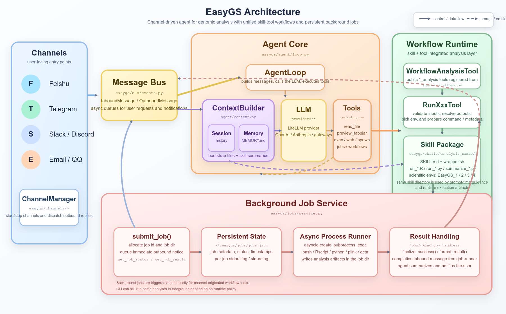

<div align="center">
  
  <h1>EasyGS: An AI Research Assistant for Genomic Selection</h1>
  <p>
    <a href="README.md">
      
    </a>
    <a href="README_zh.md">
      
    </a>
  </p>
</div>

EasyGS is a lightweight LLM agent framework for genomic selection and genomic data analysis. It combines a conversational agent, background task execution, explicit file-input workflows, and multi-channel messaging, allowing researchers to drive local genomic breeding analysis through natural language.

<div align="center">
  
</div>

## What EasyGS Can Do :sunny:

EasyGS is built for research and breeding scenarios. It provides both:

- an interactive assistant for asking questions, filling in parameters, and organizing results
- reusable analysis tools that actually run local scripts and command-line workflows

The project includes many built-in analysis workflows, such as:

- variant QC, filtering, format conversion, and subset extraction
- allele frequency, MAF, LD, Tajima's D, nucleotide diversity, PCA, GRM, and ADMIXTURE
- environmental-factor correlation, phenotype correlation, BLUP, reaction norm, and variance decomposition
- GEBV estimation, rrBLUP prediction, combining ability analysis, GWAS, and QEI detection
- candidate-gene extraction, GO/KEGG enrichment, protein function annotation, PFAM enrichment, ortholog extraction, and peak annotation

Detailed built-in capabilities are listed below by category:

| Category | Skill | Description |
| --- | --- | --- |
| Variant QC and data preparation | `fastq_to_vcf_analysis` | Process any number of maize paired-end FASTQ samples into a jointly called VCF using the managed B73 v4 reference. |
| Variant QC and data preparation | `vcf_stats` | Generate basic VCF statistics and summary output. |
| Variant QC and data preparation | `vcf_variant_extract_analysis` | Extract a subset VCF by variant ID list using bcftools. |
| Variant QC and data preparation | `vcf_format_conversion_analysis` | Convert between VCF, PED/MAP, and BED/BIM/FAM formats. |
| Variant QC and data preparation | `missingness_analysis` | Run missing-rate analysis and generate a report. |
| Variant QC and data preparation | `variant_filter_analysis` | Perform PLINK variant filtering and export filtered results. |
| Variant QC and data preparation | `sample_subset_analysis` | Keep or remove samples and export subset datasets. |
| Variant QC and data preparation | `locus_subset_analysis` | Keep or remove loci and export subset datasets. |
| Variant QC and data preparation | `bfile_extract_analysis` | Extract variants from a PLINK BFILE into a new dataset. |
| Variant QC and data preparation | `genotype_imputation_analysis` | Run genotype imputation with Beagle. |
| Population genetics and structure | `allele_count_analysis` | Count alleles and summarize the number of polymorphic sites. |
| Population genetics and structure | `allele_frequency_analysis` | Compute allele frequencies and summarize the proportion of polymorphic sites. |
| Population genetics and structure | `allele_frequency_spectrum_analysis` | Analyze the allele-frequency spectrum. |
| Population genetics and structure | `maf_distribution_analysis` | Summarize the MAF distribution. |
| Population genetics and structure | `ld_prune_analysis` | Perform LD pruning. |
| Population genetics and structure | `ld_decay_analysis` | Run LD decay analysis. |
| Population genetics and structure | `region_r2_analysis` | Compute locus-level R2 values within a specified genomic region. |
| Population genetics and structure | `tajima_d_analysis` | Calculate Tajima's D. |
| Population genetics and structure | `nucleotide_diversity_analysis` | Run site-level or window-based nucleotide-diversity analysis. |
| Population genetics and structure | `mean_nucleotide_diversity_analysis` | Compute average pi from a `.sites.pi` file. |
| Population genetics and structure | `pca_analysis` | Run PCA and generate an explained-variance report. |
| Population genetics and structure | `grm_analysis` | Build a genomic relationship matrix (GRM). |
| Population genetics and structure | `admixture_analysis` | Run ADMIXTURE population-structure analysis. |
| Population genetics and structure | `population_structure_kinship_analysis` | Run LD pruning, PCA, GRM construction, and ADMIXTURE in one workflow. |
| Phenotype, environment, and interaction analysis | `phenotype_blup_analysis` | Compute BLUP values from multi-environment phenotype data. |
| Phenotype, environment, and interaction analysis | `phenotype_region_correlation_analysis` | Compute cross-region phenotype correlations and render a heatmap. |
| Phenotype, environment, and interaction analysis | `env_factor_correlation_analysis` | Compute environmental-factor correlations and render a heatmap. |
| Phenotype, environment, and interaction analysis | `env_region_correlation_analysis` | Compute cross-region environmental correlations and render a heatmap. |
| Phenotype, environment, and interaction analysis | `environment_index_analysis` | Run a CERIS-style environment index workflow. |
| Phenotype, environment, and interaction analysis | `reaction_norm_analysis` | Estimate reaction-norm intercepts and slopes. |
| Phenotype, environment, and interaction analysis | `variance_decomposition_analysis` | Decompose phenotype variance into genotype, environment, and residual components. |
| Phenotype, environment, and interaction analysis | `gene_environment_interaction_analysis` | Run SNP-by-environment-factor interaction analysis. |
| Phenotype, environment, and interaction analysis | `locus_locus_interaction_analysis` | Run gene-by-gene interaction analysis from VCF, phenotype, and gene-map inputs. |
| Breeding value evaluation and prediction | `heritability` | Estimate trait heritability. |
| Breeding value evaluation and prediction | `gebv_analysis` | Estimate genomic estimated breeding values (GEBV). |
| Breeding value evaluation and prediction | `rrblup_prediction_analysis` | Run genomic prediction with rrBLUP. |
| Breeding value evaluation and prediction | `combining_ability_analysis` | Estimate parental GCA and hybrid SCA. |
| Breeding value evaluation and prediction | `qei_detection_analysis` | Run multi-environment QEI detection. |
| Association mapping and functional interpretation | `gwas_analysis` | Run GWAS. |
| Association mapping and functional interpretation | `candidate_gene_extraction_analysis` | Extract maize, wheat, or rice candidate genes by LD expansion and species gene-BED overlap. |
| Association mapping and functional interpretation | `gene_function_annotation_analysis` | Run GO/KEGG enrichment analysis. |
| Association mapping and functional interpretation | `wheat_rice_gene_function_enrichment_analysis` | Run offline GO/KEGG enrichment for wheat or rice using user-managed species databases. |
| Association mapping and functional interpretation | `protein_function_annotation_analysis` | Extract protein function/domain annotations for a maize gene list. |
| Association mapping and functional interpretation | `pfam_enrichment_analysis` | Run streaming PFAM/domain enrichment for maize, wheat, or rice. |
| Association mapping and functional interpretation | `ortholog_extraction_analysis` | Extract maize, wheat, or rice ortholog rows using species matrix resources. |
| Association mapping and functional interpretation | `peak_annotation_analysis` | Perform maize, wheat, or rice structural annotation for BED intervals. |

## Key Characteristics :balloon:

- Innovative functionality: focused on genomic breeding analysis tasks with common built-in skills
- Stable capabilities: uses a `skills + tools` structure to keep analysis behavior reliable
- Background execution: long-running requests run as agentic workflows that can be queried later
- Optimized file reading: tuned for common genomic breeding files such as VCF to avoid excessive context from raw file reads
- Research mode: analysis results are not written into Memory, avoiding interference between repeated analysis runs
- Multi-channel usage: can be used from the CLI or integrated with messaging platforms
- Research-friendly: can be extended quickly through combinations of tools, agentic workflows, and skills


## Installation :electric_plug:

The recommended way to install EasyGS is Docker. The Docker image contains
EasyGS and the analysis environments, so users only need to mount their
configuration/workspace directory and data directory.

### Recommended: Docker

Requirements:

- Linux x86_64 with Bash and curl
- Git, Docker Engine, and Docker Compose; the installer prefers the v2
  `docker compose` plugin but also supports the packaged `docker-compose`
  command, and can install missing dependencies with `sudo` after confirmation
- a working LLM provider/API key
- two host directories:
  - `easygs-home`: mounted to `/home/easygs/.easygs`; stores `config.json`,
    workspace outputs, resources, history, and runtime state.
  - `data`: mounted to `/data`; stores user datasets. Refer to files inside
    EasyGS by their container paths, such as `/data/example.vcf.gz`.

#### One-command installation

On a Linux x86_64 host, run the following command. If Git, Docker, or Compose is
missing, the installer offers to install it first:

```bash
curl -fsSL https://raw.githubusercontent.com/lukegood/EasyGS/master/install.sh | bash
```

The installer uses `~/easygs` by default, fetches the latest source from GitHub,
builds the image with all five analysis environments, and starts EasyGS. During
installation, an interactive wizard selects the LLM provider and configures the
API key, API base, and default model; secret input is hidden. The first build
downloads a substantial set of dependencies. To select the install directory,
data directory, or Git ref:

```bash
curl -fsSL https://raw.githubusercontent.com/lukegood/EasyGS/master/install.sh | \
  bash -s -- --install-dir "$HOME/apps/easygs" --data-dir "$HOME/easygs-data" --ref master
```

After publishing a public image, skip the local build and pull it directly:

```bash
curl -fsSL https://raw.githubusercontent.com/lukegood/EasyGS/master/install.sh | \
  bash -s -- --image <registry>/<namespace>/easygs:analysis
```

Configuration is stored in `~/easygs/.env`. Running the installer again updates
the source and container while preserving model, API key, Feishu, and email
settings. Missing host dependencies are never installed without confirmation.
Mamba, R, and bioinformatics tools remain isolated inside the Docker image.
Use `--non-interactive` on unattended servers or in CI to skip the API wizard,
then edit `.env` separately. To explicitly allow missing host dependencies to
be installed in the same unattended run:

```bash
curl -fsSL https://raw.githubusercontent.com/lukegood/EasyGS/master/install.sh | \
  bash -s -- --install-deps --non-interactive
```

#### Option A: Use a Published Image

Use the root-level `docker-compose.yml`. It has no `build:` section and pulls a
published image directly.

```bash
cd /path/to/easygs
cp .env.example .env
mkdir -p ./easygs-home ./data
# Edit .env: set EASYGS_IMAGE to the published image, plus model/provider keys.
docker compose pull
docker compose up -d
```

#### Option B: Build Locally

Use the compose file under `container/`. It is intentionally build-oriented and
contains the local `build:` section.

```bash
cd /path/to/easygs
cd container
cp .env.example .env
mkdir -p ./easygs-home /path/to/data
# Edit .env: set EASYGS_HOME_DIR, EASYGS_DATA_DIR, model, and provider keys.
docker compose build
docker compose up -d
```

On first start, the container creates the missing EasyGS files and directories
under `easygs-home`, including `config.json`, `workspace/`, `resources/`,
`history/`, `run/`, and `cron/`. Existing files are preserved.

Open:

```text
http://127.0.0.1:25685
```

External resources are not bundled into the image. Put them under
`easygs-home/resources/`.

For more Docker details, see [container/README.md](container/README.md).

### Optional: Native Installation

Native installation is mainly useful for development or for users who prefer to
manage scientific dependencies themselves.

Requirements:

- Python 3.11+
- a working LLM provider configuration
- conda or mamba if you want to run scientific analysis workflows

Install EasyGS:

```bash
pip install easygs-0.1.0-py3-none-any.whl
```

EasyGS skills require five dependency environments:

- `EasyGS_1`
- `EasyGS_2`
- `EasyGS_3`
- `EasyGS_4`
- `EasyGS_5`

Create them with:

```bash
conda env create -f env_all/EasyGS_1.yml
conda env create -f env_all/EasyGS_2.yml
conda env create -f env_all/EasyGS_3.yml
conda env create -f env_all/EasyGS_4.yml
conda env create -f env_all/EasyGS_5.yml
```

Different workflows are bound to different environments depending on their R, Python, and command-line dependencies. Each workflow checks whether its required environment exists before execution and returns a clear error if dependencies are missing.

`fastq_to_vcf_analysis` uses the `EasyGS_5` conda environment because its original
pipeline depends on fastp, BWA, samtools, Picard, GATK, bgzip, and tabix.

## External Resources :open_file_folder:

Some workflows require large reference files that are not packaged with EasyGS. User-managed resources should be placed under:

```text
~/.easygs/resources/
```

You can set `EASYGS_RESOURCES_DIR` to use a different resource root.

### `fastq_to_vcf_analysis`

Maize B73 v4 reference and indexes:

```text
~/.easygs/resources/fastq_to_vcf_analysis/Zm-B73-REFERENCE-GRAMENE-4.0.fa
~/.easygs/resources/fastq_to_vcf_analysis/Zm-B73-REFERENCE-GRAMENE-4.0.fa.amb
~/.easygs/resources/fastq_to_vcf_analysis/Zm-B73-REFERENCE-GRAMENE-4.0.fa.ann
~/.easygs/resources/fastq_to_vcf_analysis/Zm-B73-REFERENCE-GRAMENE-4.0.fa.bwt
~/.easygs/resources/fastq_to_vcf_analysis/Zm-B73-REFERENCE-GRAMENE-4.0.fa.pac
~/.easygs/resources/fastq_to_vcf_analysis/Zm-B73-REFERENCE-GRAMENE-4.0.fa.sa
~/.easygs/resources/fastq_to_vcf_analysis/Zm-B73-REFERENCE-GRAMENE-4.0.fa.fai
~/.easygs/resources/fastq_to_vcf_analysis/Zm-B73-REFERENCE-GRAMENE-4.0.dict
```

The tool accepts a FASTQ directory containing any number of matched `<sample_id>_1.fq.gz` and
`<sample_id>_2.fq.gz` pairs. Reference and helper-script paths are not public parameters. Outputs
retain the original `01-QC`, `02-Mapping`, `03-VariantCalling`, `04-Output`, and `logs` layout.

### `candidate_gene_extraction_analysis`

Species gene-interval resources:

```text
~/.easygs/resources/candidate_gene_extraction_analysis/allV4gene.bed
~/.easygs/resources/candidate_gene_extraction_analysis/allwheatgene.bed
~/.easygs/resources/candidate_gene_extraction_analysis/allricegene.bed
```

The tool accepts a loci BED, `species=maize/wheat/rice`, an LD distance, and an optional output
prefix. It automatically selects the matching gene BED; resource paths are not public parameters.
Outputs include the expanded BED, sorted unique candidate-gene list, detailed locus-to-gene TSV,
and a summary.

### `protein_function_annotation_analysis` / `pfam_enrichment_analysis`

Species resources:

```text
~/.easygs/resources/pfam_enrichment_analysis/all_maize_longest_cds.txt
~/.easygs/resources/pfam_enrichment_analysis/all_maize_genes_proteins.fa.tsv
~/.easygs/resources/pfam_enrichment_analysis/wheat_interpro.tsv
~/.easygs/resources/pfam_enrichment_analysis/Osativa_323_v7.0.protein_primaryTranscriptOnly.fa.tsv
```

Protein function annotation remains maize-only and uses the first two files. PFAM enrichment accepts `species=maize/wheat/rice` and automatically selects the corresponding resources; paths are not public parameters. Multi-gigabyte wheat/rice InterProScan files are processed as streams, with numeric transcript suffixes removed before matching.

### `peak_annotation_analysis`

Required species resources:

```text
~/.easygs/resources/peak_annotation_analysis/Zea_mays.B73_RefGen_v4.43_modify.gff3
~/.easygs/resources/peak_annotation_analysis/Taestivumcv_ChineseSpring_725_v2.1.gene.gff3
~/.easygs/resources/peak_annotation_analysis/Osativa_323_v7.0.gene.gff3
```

The tool accepts a BED file and `species` (`maize`, `wheat`, or `rice`), then resolves the matching GFF3 automatically. GFF3 paths are not public tool parameters. The legacy default species is maize; missing resources and BED/GFF3 chromosome-name mismatches are reported before execution.

### `ortholog_extraction_analysis`

Required species resources:

```text
~/.easygs/resources/ortholog_extraction_analysis/maize_ortholog_matrix.tsv
~/.easygs/resources/ortholog_extraction_analysis/wheat_ortholog_matrix.tsv
~/.easygs/resources/ortholog_extraction_analysis/rice_ortholog_matrix.tsv
```

The tool accepts a gene-list TXT and `species`, automatically selects the corresponding matrix, and matches full gene IDs exactly against its first column. Matrix paths are not public parameters. A trailing `_genes` is removed from the default output stem, so `100_wheat_genes.txt` produces `100_wheat.ortholog.tsv`.

### `wheat_rice_gene_function_enrichment_analysis`

Required files:

```text
~/.easygs/resources/wheat_rice_gene_function_enrichment_analysis/wheat_gene_KO_one2one.tsv
~/.easygs/resources/wheat_rice_gene_function_enrichment_analysis/rice_gene_KO_one2one.tsv
~/.easygs/resources/wheat_rice_gene_function_enrichment_analysis/taes_KEGG_annotation.txt
~/.easygs/resources/wheat_rice_gene_function_enrichment_analysis/rice_KEGG_annotation.txt
~/.easygs/resources/wheat_rice_gene_function_enrichment_analysis/wheat_gene_GO_one2one.tsv
~/.easygs/resources/wheat_rice_gene_function_enrichment_analysis/rice_gene_GO_one2one.tsv
~/.easygs/resources/wheat_rice_gene_function_enrichment_analysis/GO_term_table_2026.7.16.tsv
```

The tool asks only for a gene list and species, then selects the matching GO/KO mapping and annotation databases from the resource directory automatically. Resource paths are not normal tool inputs.

## Quick Start :bicyclist:

Initialize local configuration and workspace first:

```bash
easygs onboard
```

This creates:

- config file: `~/.easygs/config.json`
- EasyGS workspace template files
- resources directory: `~/.easygs/resources/`

Then fill in your provider credentials in `~/.easygs/config.json`, and run a simple chat once:

```bash
easygs agent -m "Hello, EasyGS"
```

Continuous chat:

```bash
easygs agent
```

After loading finishes, you can keep chatting in the same session.

If you want to use Feishu or other channel integrations:

```bash
easygs gateway
```

Then follow the setup guide for [Feishu](docs/feishu.md) or other channels.

Useful CLI commands include:

- `easygs onboard`: initialize EasyGS, only needed once after installation
- `easygs agent`: start an ongoing conversation with EasyGS
- `easygs gateway`: start the EasyGS gateway service for Feishu and other channels
- `easygs status`: check EasyGS status

## WebUI :computer:

EasyGS can serve a text-only browser UI from the websocket channel. Enable it in
`~/.easygs/config.json`:

```json
{ "channels": { "websocket": { "enabled": true, "port": 25685 } } }
```

Then start:

```bash
easygs gateway
```

Open `http://127.0.0.1:25685`. Image and media upload are intentionally not
enabled in the EasyGS WebUI.

## Configuration :golf:

Default configuration file path:

```text
~/.easygs/config.json
```

The configuration file mainly controls:

- LLM providers and the default model
- messaging channels
- email notifications
- workspace behavior

EasyGS uses a provider registry for model routing. It currently supports the providers defined in the configuration file.

## Research Mode and Analysis Workflows :violin:

EasyGS distinguishes between regular chat usage and analysis-oriented usage. For scientific workflows, Research mode is recommended to avoid interference between repeated analysis runs. EasyGS enables Research mode by default.

## Typical Workflow Behavior :book:

1. The user provides a request, file paths, and key parameters.
2. EasyGS checks whether required files and environments/tools exist.
3. The workflow runs in the designated conda environment.
4. Outputs are written to the target directory.
5. A summary file is generated for result delivery.

When `output_dir` is not explicitly specified, EasyGS writes results to a default directory like:

```text
~/.easygs/workflows/runs/<workflow_id>/actions/<action_id>
```

unless the user explicitly sets `output_dir`.

## Using EasyGS Through Feishu and Other Channels :microphone:

In addition to the CLI, EasyGS can also run through multiple messaging channels:

- Telegram
- [Feishu](docs/feishu.md) (Recommended)
- Discord
- DingTalk
- Slack
- QQ
- Email
- WhatsApp
- Mochat

Channel settings are stored in `~/.easygs/config.json`.

## How to Extend EasyGS :headphones:

EasyGS is designed to be easy to extend. Adding a new workflow usually involves:

1. Adding a new tool under `easygs/agent/tools`
2. Implementing `prepare_run()` and `to_metadata()` for workflow action execution
3. Registering the workflow action in `easygs/agent/workflows.py`
4. Adding a new skill directory under `easygs/skills` when the agent needs domain guidance

## License :book:

EasyGS is released under the MIT License.

## Acknowledgement :gift:

This project was inspired by [nanobot](https://github.com/HKUDS/nanobot) from [HKUDS](https://github.com/HKUDS) and built on top of its architecture.
We sincerely thank the original authors for their open-source contribution.
