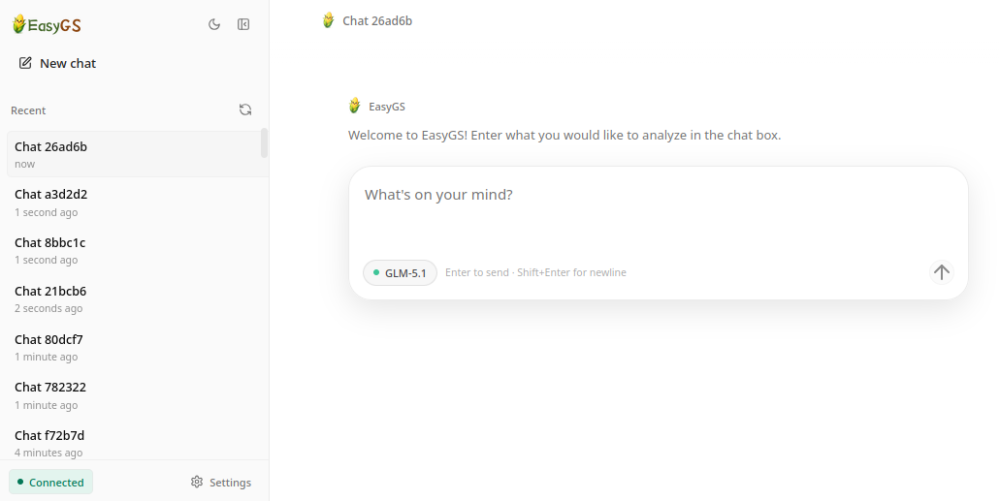
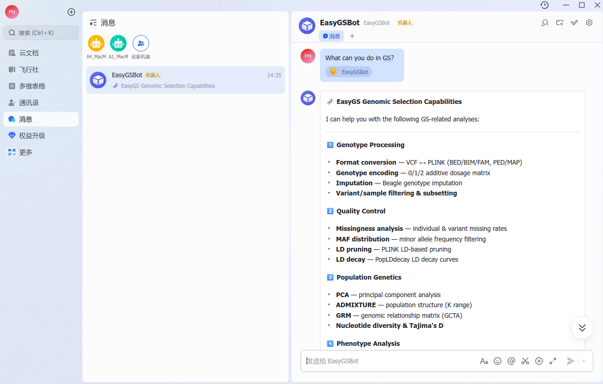
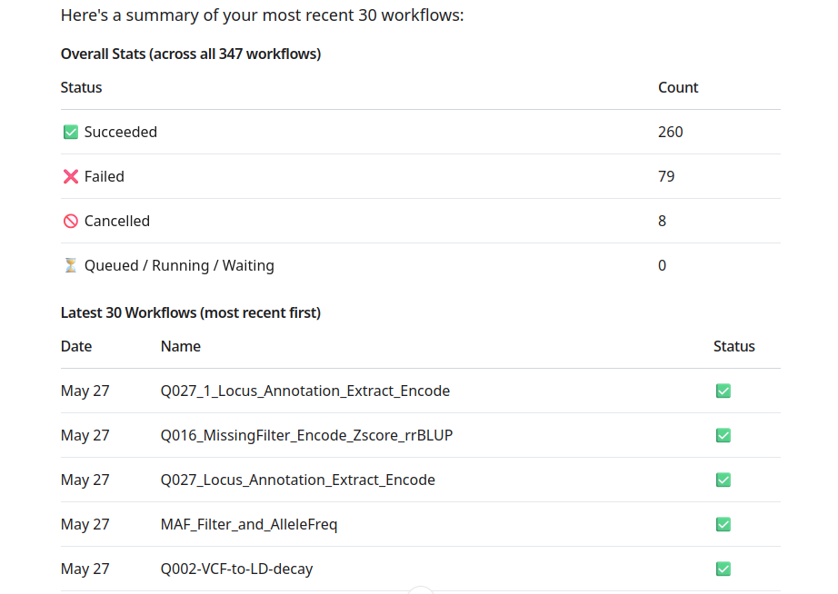
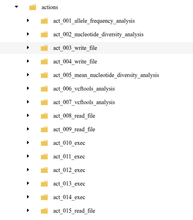
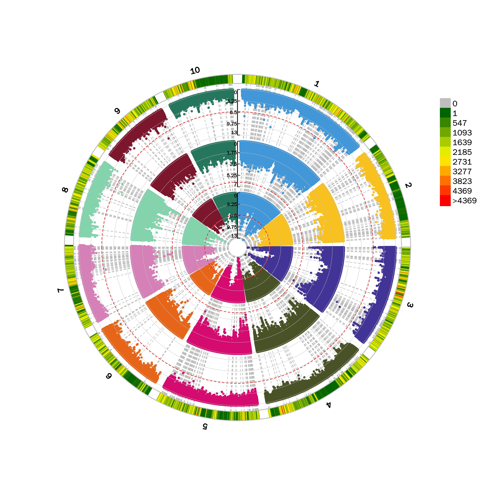

<div align="center">
  
  <h1>EasyGS：自然语言驱动作物基因组选择分析的AI智能体</h1>
  
  
  
  <p>
    <a href="README.md">
      
    </a>
    <a href="README_zh.md">
      
    </a>
  </p>
</div>

EasyGS是一个面向作物基因组选择分析的AIAgent。用户可以用自然语言描述分析需求，EasyGS会协助检查输入文件、补全参数、调用经人工验证的GS分析流程，并整理输出结果，帮助您完成GS分析任务。

## :raised_hands: 为什么选择EasyGS?
- **专业的GS分析能力**: 39种经人工审查和验证的GS分析工具，覆盖数据质控、群体结构、遗传参数估计、基因组预测、环境互作、GWAS 和功能注释等常用环节。
- **自然语言驱动**：用对话方式提交VCF、表型、环境因子、基因注释等分析任务，无需手工编写代码。
- **长任务后台运行**：任务后台执行，不担心中断。
- **全程可追溯**：随时查看分析进展，保留每一步的中间结果，可随时复盘。
- **灵活的使用方式**：支持Web UI、命令行、Telegram、飞书等消息渠道，总有适合您的方式。

## :earth_asia: 界面展示

<table>
  <tr>
    <td align="center" valign="top" width="55%">
      <h3>Web UI</h3>
      <p>在浏览器中与EasyGS对话，简洁高效</p>
      
    </td>
    <td align="center" valign="top" width="45%">
      <h3>多种聊天软件接入</h3>
      <p>通过Telegram、飞书等消息渠道使用EasyGS，支持移动端使用</p>
      
    </td>
  </tr>
</table>

## :tada: 功能展示

<table>
  <tr>
    <td align="center" valign="top" width="60%">
      <h3>工作流实时查询</h3>
      <p>后台分析任务可随时查看状态、进度和结果</p>
      
    </td>
    <td align="center" valign="top" width="40%">
      <h3>全流程可追溯</h3>
      <p>保留分析步骤和中间结果，便于复盘分析过程</p>
      
    </td>
  </tr>
</table>

<div align="center">
  <h3>多样的GS分析工具</h3>
  <p>覆盖数据质控、基因组预测、GWAS、环境互作、相关性分析、功能注释等常用流程...</p>
  <table>
    <tr>
      <td align="center" valign="top" width="50%">
        
      </td>
      <td align="center" valign="top" width="50%">
        
      </td>
    </tr>
  </table>
</div>

<p align="center"><strong>更多工具等你探索...</strong></p>

## :raising_hand: 安装

> [!WARNING]
> EasyGS是可执行分析任务的AI Agent，可能会创建、修改或删除文件。请在测试或独立工作目录中使用，并提前备份重要数据。不建议直接用于生产环境。

使用EasyGS的最简单方式是本地安装。

### 1. 基础环境要求

- Python 3.11 或更新版本
- conda 或 mamba
- 可用的 LLM API key

### 2. 安装 EasyGS

直接从 GitHub Release 安装最新版 wheel：

```bash
pip install https://github.com/lukegood/EasyGS/releases/download/v0.1.5/easygs-0.1.5-py3-none-any.whl
```

也可以打开发布页面手动下载 wheel：

- 最新发布页面：<https://github.com/lukegood/EasyGS/releases/latest>
- 当前 wheel：<https://github.com/lukegood/EasyGS/releases/download/v0.1.5/easygs-0.1.5-py3-none-any.whl>

下载完成后，在本地安装：

```bash
pip install /path/to/easygs-0.1.5-py3-none-any.whl
```

确认安装成功：

```bash
easygs --version
```

### 3. 安装分析依赖环境

EasyGS 的分析工具依赖多个 conda 环境。请从发布页面下载源码，或直接克隆仓库，然后使用 `env_all/` 目录创建环境：

```bash
git clone https://github.com/lukegood/EasyGS.git
cd EasyGS
```

```bash
conda env create -f env_all/EasyGS_1.yml
conda env create -f env_all/EasyGS_2.yml
conda env create -f env_all/EasyGS_3.yml
conda env create -f env_all/EasyGS_4.yml
```

如果环境已经存在，可以跳过对应命令。

### 4. 初始化配置

```bash
easygs onboard
```

该命令会创建默认配置文件和工作区：

```text
~/.easygs/config.json
~/.easygs/workspace/
~/.easygs/resources/
```

### 5. 配置模型和工作区

打开配置文件：

```bash
nano ~/.easygs/config.json
```

也可以使用你习惯的编辑器，例如 VS Code、vim 或服务器上的文本编辑器。

#### 5.1 配置LLM provider

先确定您要使用哪个模型服务商，然后只配置对应的 provider。常见 provider 名称包括：

| 如果你使用 | 配置这一项 |
| --- | --- |
| DeepSeek | `providers.deepseek` |
| 智谱 GLM | `providers.zhipu` |
| Kimi / Moonshot | `providers.moonshot` |
| MiniMax | `providers.minimax` |
| Qwen / 阿里云 DashScope | `providers.dashscope` |
| 自定义兼容接口 | `providers.custom` |

配置文件中可能已经有多个 provider 段落。不使用的 provider 可以保持空值。

#### 5.2 填写 provider 凭证

在刚才选择的 provider 下填写 `apiKey` 和 `apiBase`。`apiKey` 是服务商密钥，`apiBase` 是服务商或网关提供的 API 地址。

推荐使用 DeepSeek：

```json
{
  "providers": {
    "deepseek": {
      "apiKey": "your-api-key",
      "apiBase": "your-api-base"
    }
  }
}
```

如果使用自定义兼容接口，同样填写 `custom` 下的 `apiKey` 和 `apiBase`：

```json
{
  "providers": {
    "custom": {
      "apiKey": "your-api-key",
      "apiBase": "https://your-api-base/v1"
    }
  }
}
```

#### 5.3 配置默认模型

provider 配好后，再设置 `agents.defaults.model`。模型名称要和 provider 对应：

| provider | 模型写法示例 |
| --- | --- |
| `providers.deepseek` | `deepseek-v4-pro` |
| `providers.zhipu` | `glm-5.1` |
| `providers.moonshot` | `kimi-k2.6` |
| `providers.minimax` | `MiniMax-M2.7` |
| `providers.dashscope` | `qwen-3.6-plus` |
| `providers.custom` | 你的自定义服务支持的模型名 |

例如使用DeepSeek V4 Pro时，推荐同时设置模型、生成上限和推理强度：

```json
{
  "agents": {
    "defaults": {
      "model": "deepseek-v4-pro",
      "maxTokens": 384000,
      "reasoningEffort": "max"
    }
  }
}
```

其中`maxTokens`用于控制单次回复的最大生成长度，`reasoningEffort`用于设置DeepSeek V4 Pro的推理强度。DeepSeek V4模型侧支持最高1M上下文，最大支持384000个token输出。EasyGS无contextWindow控制项，会将当前对话、工具结果和分析上下文交给所选模型处理。

#### 5.4 保存并检查配置

保存 `~/.easygs/config.json` 后运行：

```bash
easygs status
```

如果状态中显示 provider 未配置，请检查：

- 对应的`providers.<name>.apiKey`是否已填写。
- 对应的`providers.<name>.apiBase`是否已填写为服务商或网关提供的完整API地址。
- `agents.defaults.model`是否写成了对应provider的模型名。

### 6. 启用 Web UI 并开始使用

推荐使用 Web UI 作为默认交互方式。先在 `~/.easygs/config.json` 中启用 websocket：

```json
{
  "channels": {
    "websocket": {
      "enabled": true,
      "port": 25685
    }
  }
}
```

启动服务：

```bash
easygs gateway
```

如果 EasyGS 运行在本机，浏览器直接打开：

```text
http://127.0.0.1:25685
```

如果 EasyGS 运行在远程服务器上，请先在自己的电脑上建立 SSH 端口转发：

```bash
ssh -L 25685:127.0.0.1:25685 user@server_ip
```

其中 `user@server_ip` 替换为你的服务器登录用户名和地址。保持这个 SSH 连接不要关闭，然后在自己电脑的浏览器中打开：

```text
http://127.0.0.1:25685
```

如果本地 `25685` 端口已经被占用，可以换一个本地端口，例如：

```bash
ssh -L 18080:127.0.0.1:25685 user@server_ip
```

然后打开：

```text
http://127.0.0.1:18080
```

进入 Web UI 后，就可以直接用自然语言提交分析任务。例如：

```text
请检查 /data/example.vcf.gz 的基本统计信息
```

也可以使用命令行作为补充。单次提问：

```bash
easygs agent -m "请检查 /data/example.vcf.gz 的基本统计信息"
```

命令行交互式对话：

```bash
easygs agent
```

## :whale: 使用Docker

如果你希望使用容器统一运行环境，可以使用 Docker。

```bash
cd /path/to/easygs
cp .env.example .env
mkdir -p ./easygs-home ./data
```

编辑`.env`，填写镜像、模型和provider凭证。使用DeepSeek V4 Pro时可参考：

```dotenv
EASYGS_MODEL=deepseek-v4-pro
EASYGS_MAX_TOKENS=384000
EASYGS_REASONING_EFFORT=max
```

然后启动：

```bash
docker compose pull
docker compose up -d
```

请确认`EASYGS_IMAGE`、`EASYGS_MODEL`和所选provider的凭证已经配置。`EASYGS_MAX_TOKENS`和`EASYGS_REASONING_EFFORT`会映射到EasyGS默认Agent配置。容器内请使用`/data/...`路径引用挂载的数据文件。更多说明见[container/README_zh.md](container/README_zh.md)。

## :clap: 39种GS分析工具

| 类别 | 功能 | 说明 |
| --- | --- | --- |
| 数据质控 | VCF统计 (`vcf_stats`) | 生成 VCF 基本统计信息。 |
| 数据质控 | 等位基因频率分析 (`allele_frequency_analysis`) | 使用 vcftools 分析等位基因频率，统计多态性位点比例。 |
| 数据质控 | MAF分布分析 (`maf_distribution_analysis`) | 使用 PLINK 分析最小等位基因频率分布。 |
| 数据质控 | 缺失率分析 (`missingness_analysis`) | 使用 PLINK 分析位点或样本缺失率。 |
| 数据质控 | 位点过滤 (`variant_filter_analysis`) | 使用 PLINK 根据材料缺失率、位点缺失率、HWE 和 MAF 进行过滤。 |
| 数据质控 | VCF格式转换 (`vcf_format_conversion_analysis`) | 实现 VCF 与 PLINK BED/BIM/FAM、PED/MAP 格式互转。 |
| 数据质控 | 基因型编码 (`genotype_encoding_analysis`) | 使用 PLINK 编码 0/1/2 加性基因型。 |
| 数据质控 | VCF变体提取 (`vcf_variant_extract_analysis`) | 基于位点或材料列表从 VCF 中提取目标子集。 |
| 数据质控 | LD剪枝分析 (`ld_prune_analysis`) | 使用 PLINK 进行 LD 剪枝。 |
| 数据质控 | 区域R²分析 (`region_r2_analysis`) | 使用 PLINK 进行区域连锁不平衡 R² 分析。 |
| 数据质控 | 基因型填充 (`genotype_imputation_analysis`) | 使用 Beagle 进行基因型填充。 |
| 群体遗传结构 | 核苷酸多样性分析 (`nucleotide_diversity_analysis`) | 使用 vcftools 计算位点或窗口核苷酸多样性 π。 |
| 群体遗传结构 | PCA分析 (`pca_analysis`) | 使用 PLINK 进行主成分分析。 |
| 群体遗传结构 | ADMIXTURE分析 (`admixture_analysis`) | 使用 ADMIXTURE 进行群体结构分析，自动确定最佳 K 值。 |
| 群体遗传结构 | 基因组关系矩阵GRM (`grm_analysis`) | 使用 GCTA 构建基因组关系矩阵。 |
| 群体遗传结构 | LD衰减分析 (`ld_decay_analysis`) | 使用 PopLDdecay 进行连锁不平衡衰减分析。 |
| 遗传参数估计与基因组预测 | 遗传力估计 (`heritability`) | 使用 GCTA 计算单性状遗传力。 |
| 遗传参数估计与基因组预测 | 方差分解 (`variance_decomposition_analysis`) | 利用线性模型将表型方差分解为基因型、环境和残差组分。 |
| 遗传参数估计与基因组预测 | 表型BLUP分析 (`phenotype_blup_analysis`) | 基于多环境表型数据计算 BLUP 值。 |
| 遗传参数估计与基因组预测 | 配合力分析 (`combining_ability_analysis`) | 估计父母本 GCA 和杂交种 SCA。 |
| 遗传参数估计与基因组预测 | GEBV估计 (`gebv_analysis`) | 使用 GCTA 估计基因组育种值。 |
| 遗传参数估计与基因组预测 | rrBLUP基因组预测 (`rrblup_prediction_analysis`) | 使用 rrBLUP 进行基因组预测。 |
| 遗传参数估计与基因组预测 | VCF基因组预测矩阵 (`vcf_genomic_prediction_csv_analysis`) | 利用 VCF 生成 0/1/2 基因型 CSV 矩阵。 |
| 遗传参数估计与基因组预测 | 交叉验证分组 (`cvf_split_analysis`) | 基于材料列表生成交叉验证分组 CSV。 |
| 环境与表型数据解析 | 环境因子相关性分析 (`env_factor_correlation_analysis`) | 计算同地区不同环境因子的 Pearson 相关性并绘制热图。 |
| 环境与表型数据解析 | 跨区域表型相关性分析 (`cross_region_phenotypic_correlation_analysis`) | 计算不同地区同一表型的 Pearson 相关性并绘制热图。 |
| 环境与表型数据解析 | 环境指数分析 (`environment_index_analysis`) | 基于 CERIS 框架执行环境指数分析。 |
| 环境与表型数据解析 | 反应规范分析 (`reaction_norm_analysis`) | 将多环境表型转为长格式，计算反应规范截距和斜率。 |
| 环境与表型数据解析 | 基因型-环境GxE分析 (`GxE_analysis`) | 基于 VCF、环境因子和表型进行 SNP x 环境因子 ANOVA。 |
| 基因挖掘与功能解析 | GWAS分析 | 使用 rMVP 中的 3 种算法进行全基因组关联分析。 |
| 基因挖掘与功能解析 | QEI检测分析 (`QEI_detection_analysis`) | 使用 Fast3VmrMLM 进行多环境 QEI 检测。 |
| 基因挖掘与功能解析 | 基因型-基因型GxG分析 (`GxG_analysis`) | 基于 VCF 和表型进行 SNP x SNP ANOVA。 |
| 基因挖掘与功能解析 | 基因提取 (`gene_extraction_analysis`) | 扩展显著位点窗口并注释区间内候选基因。 |
| 基因挖掘与功能解析 | 基因功能注释 (`gene_function_annotation_analysis`) | 进行玉米基因 GO 与 KEGG 功能富集分析。 |
| 基因挖掘与功能解析 | 蛋白结构域注释 (`protein_function_annotation_analysis`) | 使用 InterProScan 进行玉米蛋白质结构域注释。 |
| 基因挖掘与功能解析 | 玉米PFAM结构域富集 (`pfam_enrichment_analysis`) | 进行玉米蛋白质结构域富集分析。 |
| 基因挖掘与功能解析 | 玉米位点结构注释 (`strcture_annotation_analysis`) | 使用 ChIPseeker 进行位点结构注释。 |
| 基因挖掘与功能解析 | 玉米基因体位点注释 (`genebody_locus_annotation_analysis`) | 注释位于玉米 B73 V4 参考基因组基因区的 SNP。 |
| 基因挖掘与功能解析 | 同源基因提取 (`ortholog_extraction_analysis`) | 提取玉米在其他物种中的同源基因集。 |

## :bell: 常用命令

| 命令 | 用途 |
| --- | --- |
| `easygs onboard` | 初始化配置和工作区。 |
| `easygs agent` | 启动命令行对话。 |
| `easygs gateway` | 启动 WebUI 或消息渠道服务。 |
| `easygs status` | 查看配置、工作区、资源和模型状态。 |
| `easygs workflows list` | 查看后台分析任务。 |
| `easygs workflows status <workflow_id>` | 查看指定任务状态。 |
| `easygs workflows result <workflow_id>` | 查看任务结果。 |

## :computer: 外部资源

部分功能需要大型参考文件，这些文件不会随 EasyGS 一起提供。默认资源目录为：

```text
~/.easygs/resources/
```

例如蛋白功能注释和 PFAM 富集需要：

```text
~/.easygs/resources/pfam_enrichment_analysis/all_maize_longest_cds.txt
~/.easygs/resources/pfam_enrichment_analysis/all_maize_genes_proteins.fa.tsv
```

如果文件缺失，EasyGS 会在运行时提示具体缺失路径。

## :telephone_receiver: 消息渠道

EasyGS 支持命令行、本地 WebUI 和多种消息渠道。启用渠道后，使用 `easygs gateway` 启动服务。

| 渠道 | 配置项 |
| --- | --- |
| WebUI | `channels.websocket` |
| [飞书](docs/feishu_zh.md) | `channels.feishu` |
| Telegram | `channels.telegram` |
| 钉钉 DingTalk | `channels.dingtalk` |
| Discord | `channels.discord` |
| Email | `channels.email` |
| Slack | `channels.slack` |
| QQ | `channels.qq` |
| WhatsApp | `channels.whatsapp` |
| Mochat | `channels.mochat` |

## :loudspeaker: 许可证

EasyGS 使用 MIT License 发布。

## :gift_heart: 致谢

本项目参考了[HKUDS](https://github.com/HKUDS) 开源项目[nanobot](https://github.com/HKUDS/nanobot)。感谢原作者的开源贡献。
