# Feishu Setup Guide

## 1. Log In to the Feishu Open Platform

Visit [https://open.feishu.cn/?lang=en-US](https://open.feishu.cn/?lang=en-US) and click **Developer Console** in the upper-right corner.

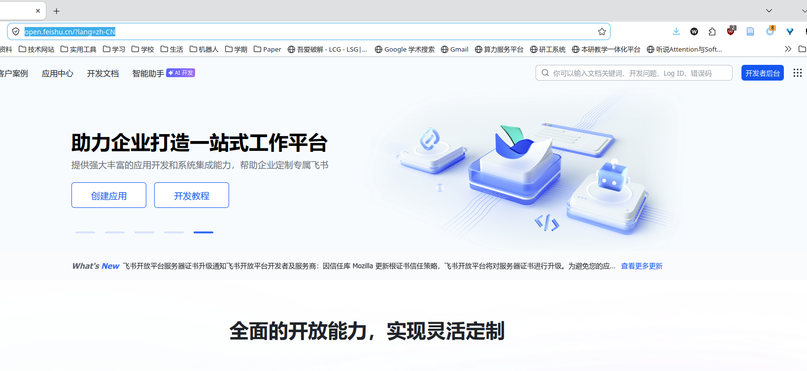

If you do not have an organization yet, please register one first and then continue with the following steps.

## 2. Create an In-House Enterprise App

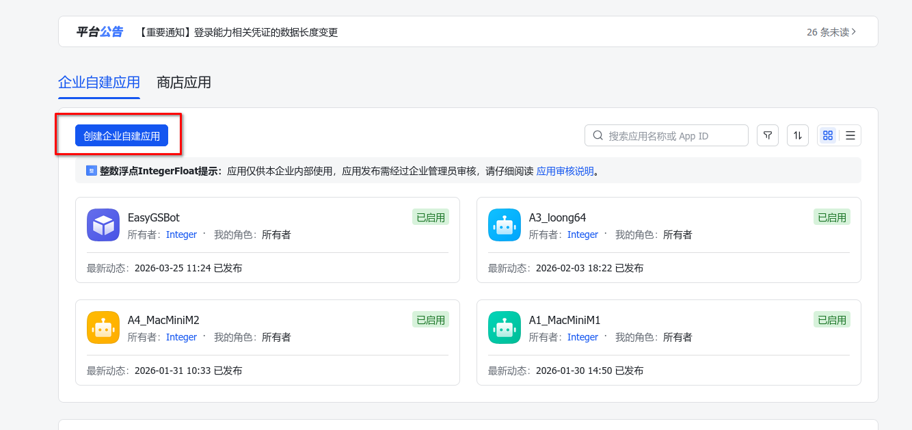

## 3. Add the Bot Capability

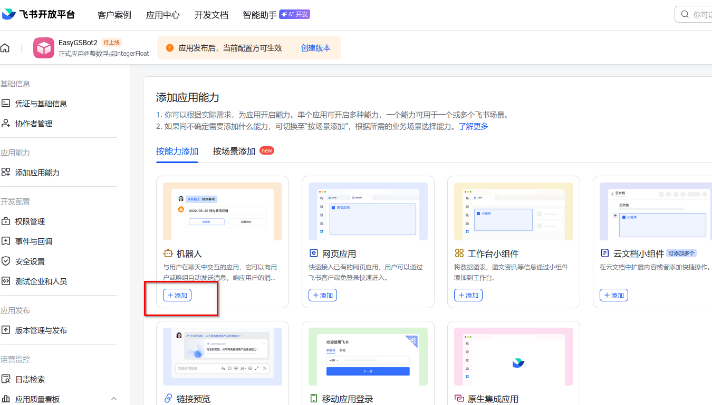

## 4. Enable Message Send and Receive Permissions

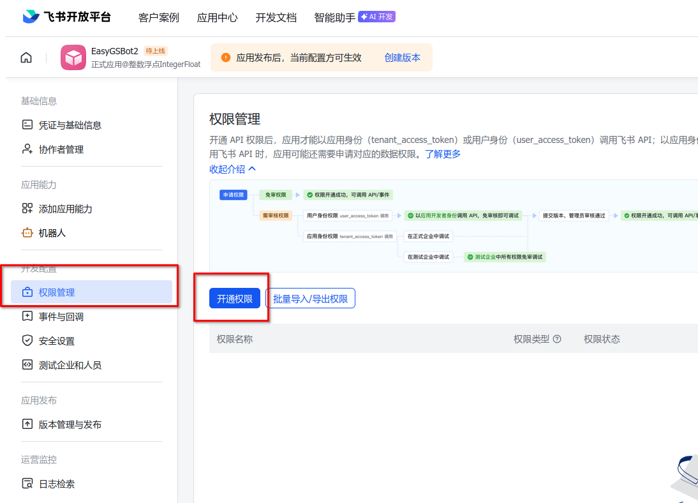
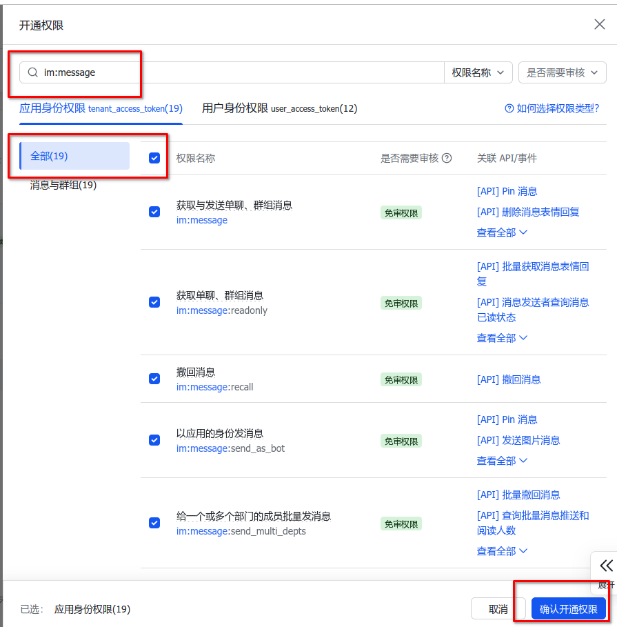
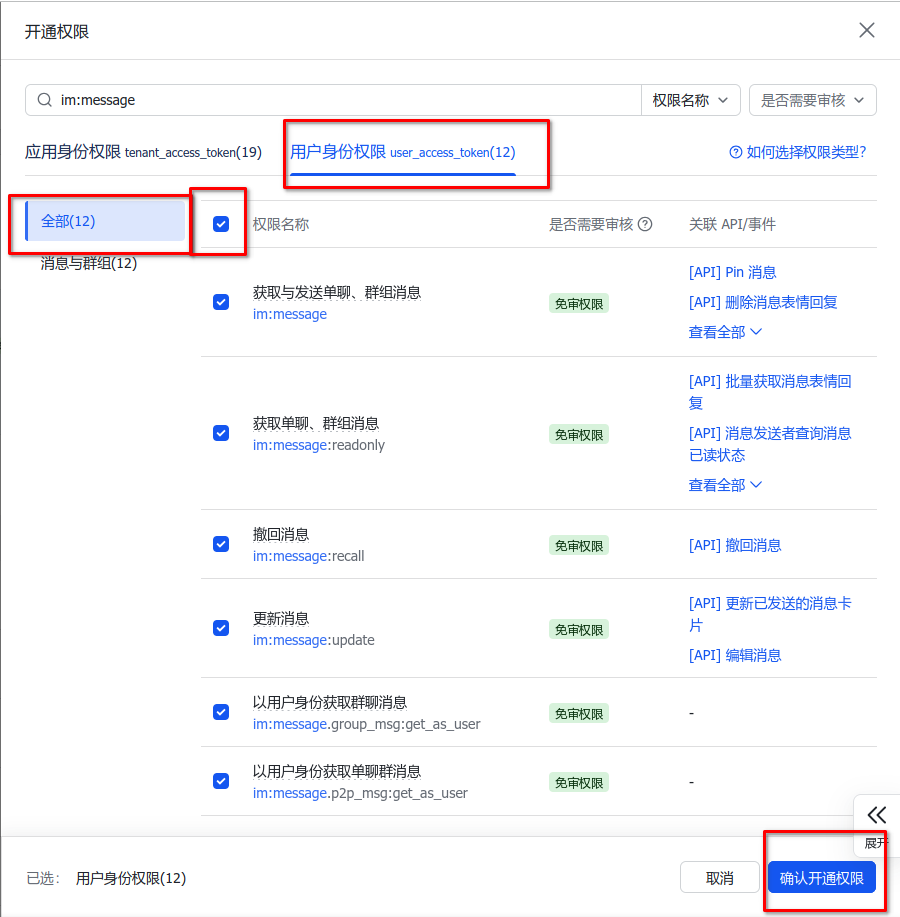
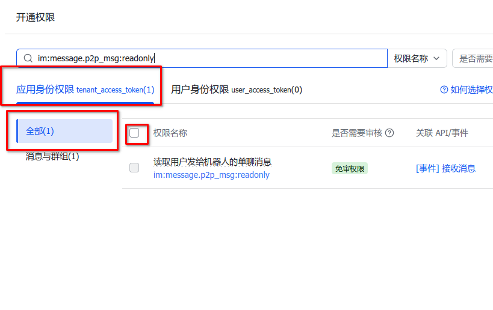

## 5. Configure Events and Callbacks

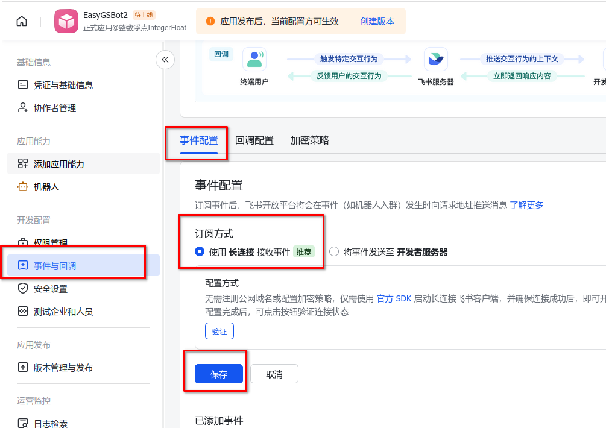
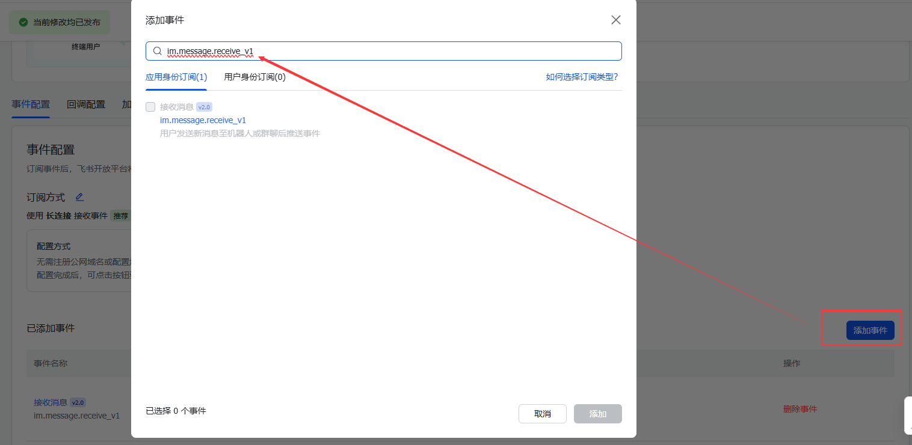
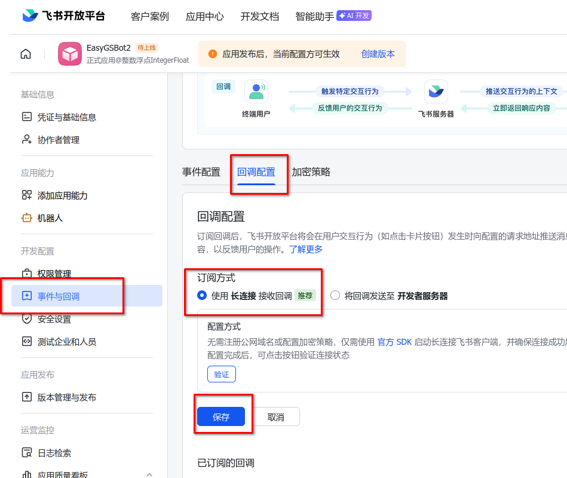

## 6. Get and Record the App ID and App Secret

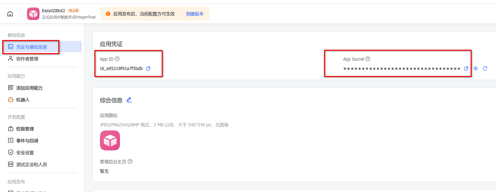

Record these two values and fill them into the EasyGS configuration file:

```text
~/.easygs/config.json
```

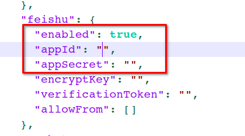

## 7. Publish the App

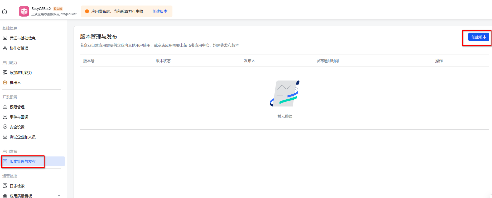
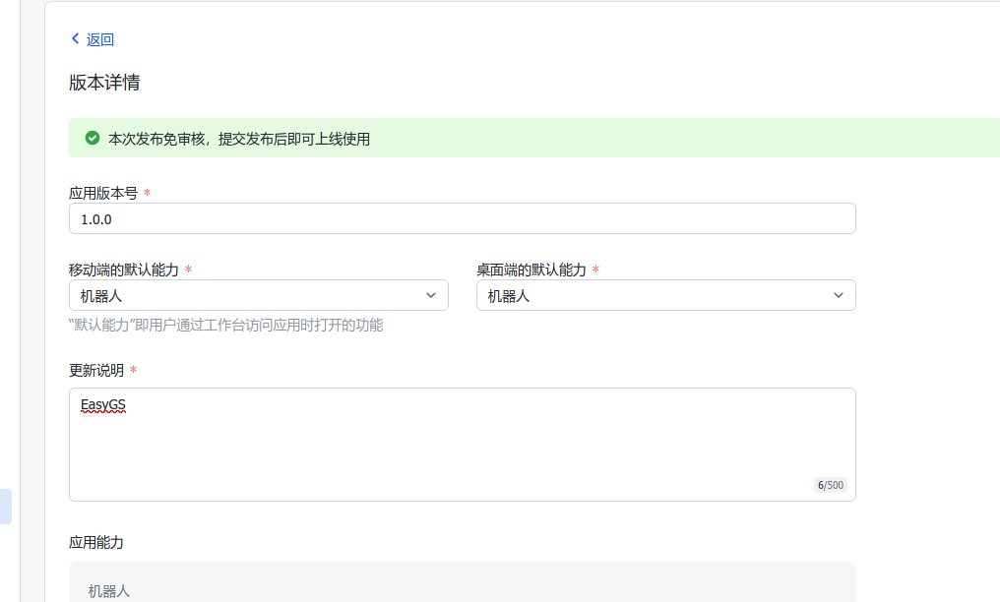

## 8. Start Using It

First, start the gateway service:

```bash
easygs gateway
```

Then open the app and begin your genomic breeding analysis workflow.

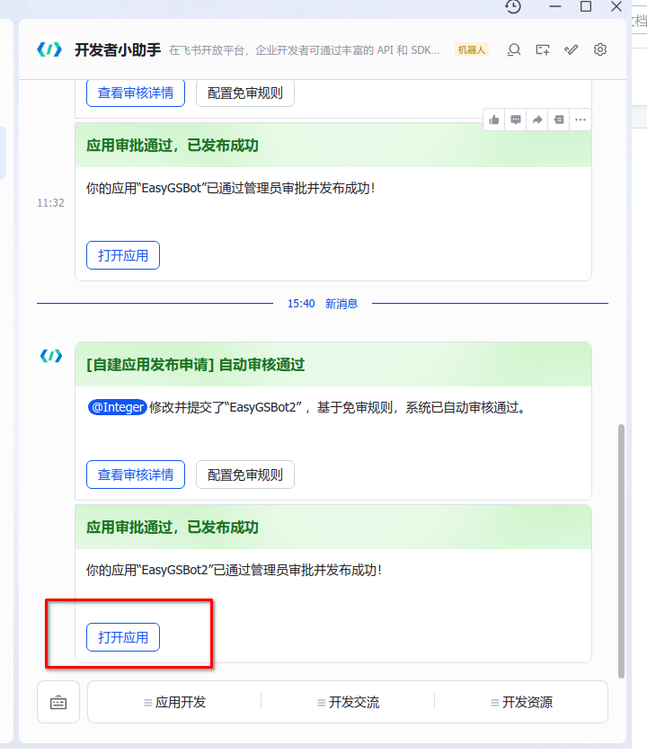
